<!-- ═══════════════════════════════════════════════════════════════════════════
     ██╗   ██╗██████╗ ██╗  ██╗ █████╗ ██╗   ██╗ █████╗ ██████╗  ██████╗  ██████╗ ██████╗  █████╗ ████████╗██╗  ██╗██╗
     ██║   ██║██╔══██╗██║  ██║██╔══██╗╚██╗ ██╔╝██╔══██╗██╔══██╗██╔═══██╗██╔═══██╗██╔══██╗██╔══██╗╚══██╔══╝██║  ██║██║
     ██║   ██║██║  ██║███████║███████║ ╚████╔╝ ███████║██████╔╝██║   ██║██║   ██║██████╔╝███████║   ██║   ███████║██║
     ██║   ██║██║  ██║██╔══██║██╔══██║  ╚██╔╝  ██╔══██║██╔══██╗██║   ██║██║   ██║██╔══██╗██╔══██║   ██║   ██╔══██║██║
     ╚██████╔╝██████╔╝██║  ██║██║  ██║   ██║   ██║  ██║██████╔╝╚██████╔╝╚██████╔╝██████╔╝██║  ██║   ██║   ██║  ██║██║
      ╚═════╝ ╚═════╝ ╚═╝  ╚═╝╚═╝  ╚═╝   ╚═╝   ╚═╝  ╚═╝╚═════╝  ╚═════╝  ╚═════╝ ╚═════╝ ╚═╝  ╚═╝   ╚═╝   ╚═╝  ╚═╝╚═╝
     Full Stack & DevOps Engineer · Salem, Tamil Nadu, India
     Theme: Cyberpunk Neon · Glassmorphism · #0a0a0f · #00f5ff · #ff00ff · #39ff14
     ═══════════════════════════════════════════════════════════════════════════ -->

<div align="center">

<!-- ═══════════════════ ANIMATED SVG BANNER ═══════════════════ -->
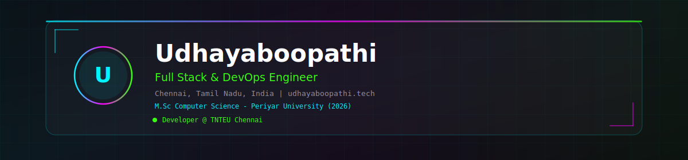

<br/><br/>

<!-- ═══════════════════ PROFILE AVATAR ═══════════════════ -->
<!-- Drop your photo at images/profile.png then change src below -->
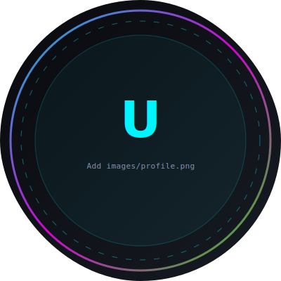

<br/><br/>

<!-- ═══════════════════ ANIMATED TYPING EFFECT ═══════════════════ -->
<a href="https://git.io/typing-svg">
  
</a>

<br/><br/>

<!-- ═══════════════════ VISITOR COUNTER & BADGES ═══════════════════ -->

&nbsp;

&nbsp;

&nbsp;


<br/><br/>


&nbsp;

&nbsp;


</div>

---

## 🌐 Professional Introduction

<div align="center">

> *"I architect production-grade systems that feel alive — intelligent, secure, and effortless to operate."*

</div>

<br/>

### 👤 Developer Identity

```json
{
  "name": "Udhayaboopathi",
  "title": "Full Stack & DevOps Engineer",
  "location": "Salem, Tamil Nadu, India",
  "timezone": "Asia/Kolkata (IST, UTC+5:30)",
  "portfolio": "https://udhayaboopathi.tech",
  "github": "https://github.com/Udhayaboopathi",
  "linkedin": "https://linkedin.com/in/udhayaboopathi",
  "email": "udhayaboopathi2003@gmail.com",
  "discord": "groot0820",
  "instagram": "@udhayaboopathi_",
  "spotify": "https://spotify-github-profile.kittinanx.com/api/view?uid=31irefn5qkpggtnpqxrkcvlo4sq4&redirect=true",
  "specializations": [
    "Full Stack Web Development",
    "DevOps & CI/CD Automation",
    "Self-Hosted PaaS Architecture",
    "Enterprise Multi-Tenant Systems",
    "Linux Server Administration",
    "AI/ML Integration & NLP",
    "Database Design & Optimization",
    "Cloud Infrastructure (AWS, Azure)"
  ],
  "philosophy": "Code should feel alive, intelligent, and effortless.",
  "currently_at": "Tamil Nadu Teachers Education University (TNTEU)"
}
```

```yaml
developer:
  name: Udhayaboopathi
  role: Full Stack & DevOps Engineer
  location: Salem, Tamil Nadu, India
  education:
    current: M.Sc Computer Science @ Periyar University
    completed: B.Sc Computer Science @ Government Arts and Science College
  focus_areas:
    - React.js & Next.js frontend architecture
    - FastAPI & Python backend services
    - Docker, Traefik & self-hosted infrastructure
    - PostgreSQL, Redis, MongoDB data layers
    - GitHub Actions CI/CD pipelines
    - AI integrations (OpenAI, Gemini)
  motto: "Build once, deploy everywhere, scale infinitely."
```

---

## 👋 About Me

<div align="center">

<table>
<tr>
<td width="50%" valign="top">

### 🎯 Who I Am

I'm **Udhayaboopathi** — a **Full Stack & DevOps Engineer** based in **Salem, Tamil Nadu, India**, passionate about building production-grade systems that are secure, scalable, and beautiful to use.

I specialize in architecting end-to-end solutions — from glassmorphism React frontends to containerized FastAPI backends, self-hosted PaaS platforms, and enterprise multi-tenant applications serving real users across Tamil Nadu.

Currently, I develop and maintain the **TNTEU Staff Portal** — a live production system used by university staff statewide — while pursuing my **M.Sc. in Computer Science** at Periyar University.

</td>
<td width="50%" valign="top">

### 🧠 Full Specialization List

| Domain | Technologies |
|:-------|:-------------|
| **Frontend** | React, Next.js, TypeScript, Tailwind CSS, HTML5, CSS3 |
| **Backend** | FastAPI, Flask, Node.js, Express, PHP |
| **Databases** | PostgreSQL, MySQL, MongoDB, Redis, SQLite |
| **DevOps** | Docker, Traefik, Nginx, GitHub Actions, CI/CD |
| **Cloud** | AWS, Azure, VPS, Self-Hosted Infrastructure |
| **AI/ML** | OpenAI API, Google Gemini, NLP, RAG, Summarization |
| **OS & Infra** | Linux (Ubuntu, Debian), Bash, Systemd, Networking |
| **Tools** | Git, VS Code, Postman, Cursor, Claude, Copilot |
| **Security** | JWT, OAuth2, 2FA, RBAC, SSL/TLS, Traefik Middleware |
| **Monitoring** | Health checks, Logging, Metrics, Uptime monitoring |

</td>
</tr>
</table>

</div>

---

## 🔥 Currently Working On · Learning · Goals

<div align="center">

<table>
<tr>
<td align="center" width="33%">

### 🚧 Currently Working On

- 🏛️ **TNTEU Staff Portal** — Production enhancements, RBAC, 2FA
- 🧱 **RolloutX** — Self-hosted PaaS with Traefik routing
- 📧 **Nexudo Mail** — Multi-tenant enterprise email platform
- 🔄 **CI/CD Pipelines** — GitHub Actions automation
- 🎨 **Glassmorphism UI** — Modern design system components

</td>
<td align="center" width="33%">

### 📚 Currently Learning

- ☸️ **Kubernetes** — Orchestration & Helm charts
- 🔐 **Zero Trust Security** — mTLS, service mesh
- 🤖 **AI Agent Frameworks** — LangChain, RAG pipelines
- 📊 **Observability** — Prometheus, Grafana, Loki
- 🦀 **Systems Programming** — Rust fundamentals
- ☁️ **Azure DevOps** — Pipelines & App Service

</td>
<td align="center" width="33%">

### 🎯 Goals (2025–2026)

- 🚀 Launch **RolloutX** as open-source PaaS
- 🏆 Contribute to **10+ open-source** projects
- 📜 Earn **AWS Solutions Architect** certification
- 🌍 Build **developer community** in Salem region
- 📈 Scale **Nexudo Mail** to 1000+ tenants
- 🎓 Complete **M.Sc.** with distinction

</td>
</tr>
</table>

</div>

---

## ⚙️ Tech Stack

<div align="center">

### 💻 Languages


<br/><br/>


<br/><br/>

### 🎨 Frontend


<br/><br/>


<br/><br/>

### ⚡ Backend


<br/><br/>


<br/><br/>

### 🗄️ Databases


<br/><br/>


<br/><br/>

### 🐳 DevOps


<br/><br/>


<br/><br/>

### ☁️ Cloud


<br/><br/>


<br/><br/>

### 🤖 AI & Machine Learning


<br/><br/>


<br/><br/>

### 🖥️ Operating Systems


<br/><br/>


<br/><br/>

### 🛠️ Tools & IDEs


<br/><br/>


</div>

---

## 📊 Skills Matrix

<div align="center">

| Skill Category | Technology | Proficiency | Years | Production Use |
|:---------------|:-----------|:-----------:|:-----:|:--------------:|
| **Frontend** | React.js | ⭐⭐⭐⭐⭐ | 3+ | ✅ TNTEU, RolloutX |
| **Frontend** | Next.js | ⭐⭐⭐⭐⭐ | 2+ | ✅ Nexudo Mail |
| **Frontend** | TypeScript | ⭐⭐⭐⭐ | 2+ | ✅ All projects |
| **Frontend** | Tailwind CSS | ⭐⭐⭐⭐⭐ | 2+ | ✅ All projects |
| **Backend** | FastAPI | ⭐⭐⭐⭐⭐ | 3+ | ✅ TNTEU, RolloutX |
| **Backend** | Python | ⭐⭐⭐⭐⭐ | 4+ | ✅ All backends |
| **Backend** | Node.js/Express | ⭐⭐⭐⭐ | 2+ | ✅ Side projects |
| **Database** | PostgreSQL | ⭐⭐⭐⭐⭐ | 3+ | ✅ RolloutX, Mail |
| **Database** | MongoDB | ⭐⭐⭐⭐ | 2+ | ✅ Smart QA |
| **Database** | Redis | ⭐⭐⭐⭐ | 2+ | ✅ Nexudo Mail |
| **DevOps** | Docker | ⭐⭐⭐⭐⭐ | 3+ | ✅ All deployments |
| **DevOps** | Traefik | ⭐⭐⭐⭐⭐ | 2+ | ✅ RolloutX, Mail |
| **DevOps** | GitHub Actions | ⭐⭐⭐⭐ | 2+ | ✅ CI/CD pipelines |
| **DevOps** | Linux Admin | ⭐⭐⭐⭐⭐ | 4+ | ✅ Periyar Univ. |
| **Cloud** | AWS | ⭐⭐⭐ | 1+ | 🔄 Learning |
| **Cloud** | Azure | ⭐⭐⭐ | 1+ | 🔄 Learning |
| **AI/ML** | OpenAI API | ⭐⭐⭐⭐ | 1+ | ✅ Smart QA |
| **AI/ML** | Google Gemini | ⭐⭐⭐⭐ | 1+ | ✅ Smart QA |
| **AI/ML** | NLP | ⭐⭐⭐⭐ | 2+ | ✅ Food Recommender |
| **Security** | JWT/OAuth2 | ⭐⭐⭐⭐⭐ | 3+ | ✅ TNTEU Portal |
| **Security** | RBAC/2FA | ⭐⭐⭐⭐⭐ | 2+ | ✅ TNTEU, Mail |

</div>

---

## 🚀 Featured Projects

<div align="center">

<a href="https://www.rolloutx.tech">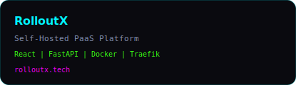</a>
<a href="https://github.com/Udhayaboopathi/Nex-Mail">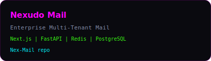</a>

<a href="https://staffportal.tnteu.ac.in/login">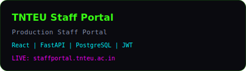</a>
<a href="https://github.com/Udhayaboopathi/smart-qa">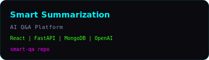</a>

</div>

---

## 📋 Project Details

<div align="center">

| # | Project | Stack | Type | Status | Highlight |
|:-:|:--------|:------|:-----|:------:|:----------|
| 1 | 🧱 **RolloutX** | React, FastAPI, Docker, Traefik, PostgreSQL | Self-Hosted PaaS | 🟢 Active | Cut manual deployment effort by **70%** |
| 2 | 📧 **Nexudo Mail** | Next.js, FastAPI, Redis, PostgreSQL, Docker, Traefik | Enterprise Multi-Tenant Mail | 🟢 Active | RBAC, campaigns, API keys, multi-tenant |
| 3 | 🏛️ **TNTEU Staff Portal** | React, FastAPI, PostgreSQL | Production Staff Portal | 🟢 Live | JWT + 2FA, RBAC, statewide deployment |
| 4 | 🧠 **Smart Summarization** | React, FastAPI, MongoDB, OpenAI, Gemini | AI Q&A Platform | 🟢 Active | Sub-500ms responses, 500+ queries/session |
| 5 | 🥗 **Organic Food Recommendation** | FastAPI, HTML, JavaScript, NLP | ML Recommender | 🟡 Complete | REST responses under 300ms, 1000+ items |

</div>

<br/>

<details>
<summary><b>🧱 RolloutX — Self-Hosted PaaS (Click to expand)</b></summary>

<br/>

| Attribute | Details |
|:----------|:--------|
| **Description** | A self-hosted Platform-as-a-Service that automates multi-app deployment with Docker and Traefik reverse proxy |
| **Frontend** | React.js with glassmorphism UI, real-time deployment status |
| **Backend** | FastAPI with async endpoints, WebSocket support |
| **Database** | PostgreSQL for app registry, deployment history, user management |
| **Infrastructure** | Docker Compose, Traefik v3, automatic SSL via Let's Encrypt |
| **Key Features** | One-click deploy, custom domains, env management, rollback, health checks |
| **Impact** | Reduced manual deployment time by 70% across multiple services |
| **URL** | [rolloutx.tech](https://www.rolloutx.tech) |

</details>

<details>
<summary><b>📧 Nexudo Mail — Enterprise Multi-Tenant Mail (Click to expand)</b></summary>

<br/>

| Attribute | Details |
|:----------|:--------|
| **Description** | Enterprise-grade multi-tenant email platform with campaign management and API integrations |
| **Frontend** | Next.js 14 with App Router, server components, Tailwind CSS |
| **Backend** | FastAPI with async mail queue processing |
| **Database** | PostgreSQL (tenant data), Redis (queues, caching, sessions) |
| **Infrastructure** | Docker, Traefik, SMTP relay integration |
| **Key Features** | Multi-tenant RBAC, email campaigns, API keys, analytics dashboard |
| **Security** | Tenant isolation, encrypted credentials, rate limiting |
| **URL** | [GitHub — Nex-Mail](https://github.com/Udhayaboopathi/Nex-Mail) |

</details>

<details>
<summary><b>🏛️ TNTEU Staff Portal — Production Staff Portal (Click to expand)</b></summary>

<br/>

| Attribute | Details |
|:----------|:--------|
| **Description** | Production staff management portal for Tamil Nadu Teachers Education University |
| **Frontend** | React.js with role-based UI rendering |
| **Backend** | FastAPI with JWT authentication and 2FA |
| **Database** | PostgreSQL with optimized queries for large datasets |
| **Key Features** | Staff records, attendance, leave management, document uploads |
| **Security** | JWT + TOTP 2FA, RBAC with granular permissions |
| **Scale** | Serving university staff across Tamil Nadu |
| **URL** | [staffportal.tnteu.ac.in](https://staffportal.tnteu.ac.in/login) |

</details>

<details>
<summary><b>🧠 Smart Summarization & Q&A (Click to expand)</b></summary>

<br/>

| Attribute | Details |
|:----------|:--------|
| **Description** | AI-powered document summarization and question-answering platform |
| **Frontend** | React.js with markdown rendering and chat interface |
| **Backend** | FastAPI with streaming responses |
| **Database** | MongoDB for document storage and conversation history |
| **AI Models** | OpenAI GPT-4, Google Gemini for multi-model support |
| **Key Features** | PDF upload, smart summarization, contextual Q&A, session management |
| **Performance** | Sub-500ms response times across 500+ queries per session |
| **URL** | [GitHub — smart-qa](https://github.com/Udhayaboopathi/smart-qa) |

</details>

<details>
<summary><b>🥗 Organic Food Recommendation System (Click to expand)</b></summary>

<br/>

| Attribute | Details |
|:----------|:--------|
| **Description** | NLP-based organic food recommendation engine with personalized suggestions |
| **Frontend** | HTML, CSS, JavaScript with responsive design |
| **Backend** | FastAPI with NLP processing pipeline |
| **AI/NLP** | TF-IDF vectorization, cosine similarity, content-based filtering |
| **Key Features** | User preference profiling, dietary filters, nutritional scoring |
| **Performance** | REST API responses under 300ms across 1,000+ food items |
| **Dataset** | 1,000+ organic food items with nutritional metadata |

</details>

---

## 📸 Project Screenshots

<div align="center">

| RolloutX Dashboard | Nexudo Mail Inbox |
|:----------------:|:-----------------:|
| 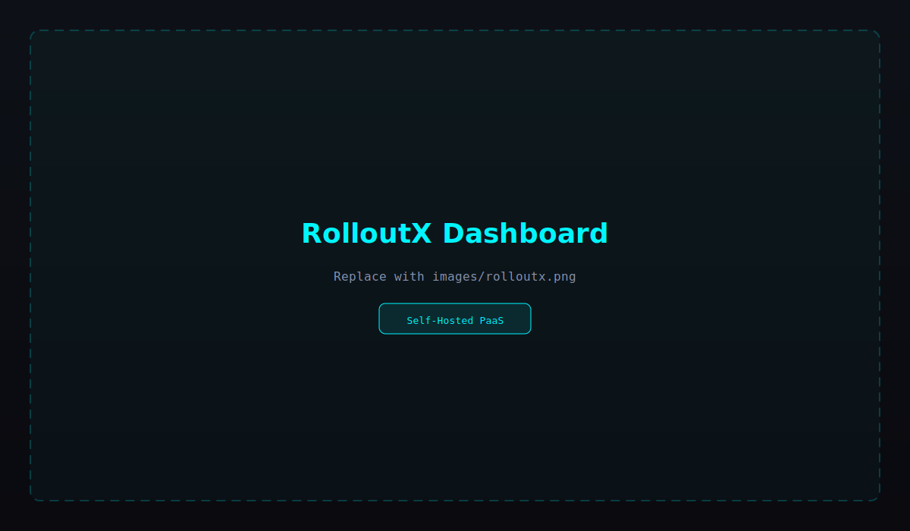 | 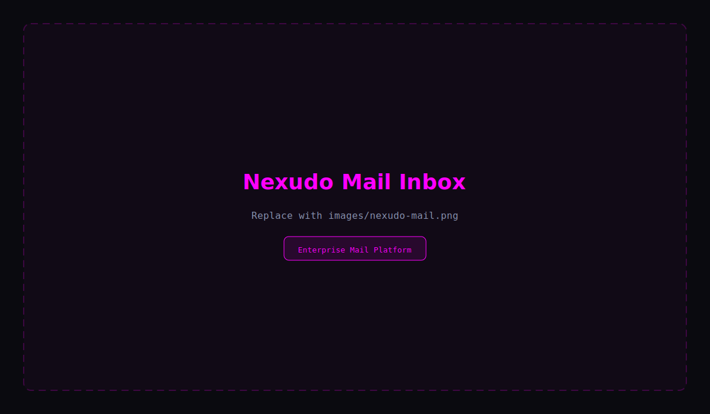 |

| TNTEU Staff Portal | Smart Summarization Q&A |
|:------------------:|:-----------------------:|
| 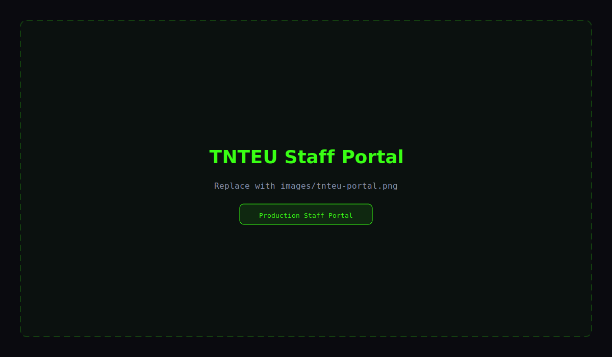 | 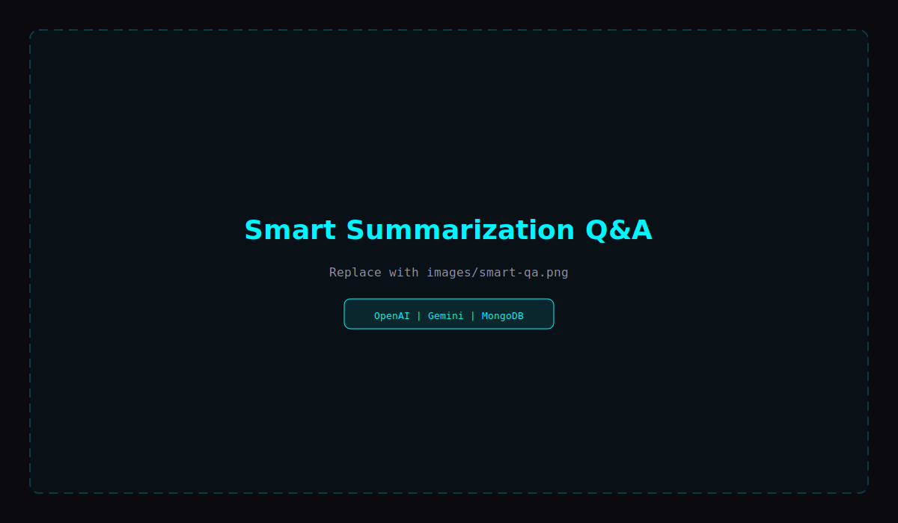 |

| Organic Food Recommender | DevOps CI/CD Pipeline |
|:------------------------:|:---------------------:|
| 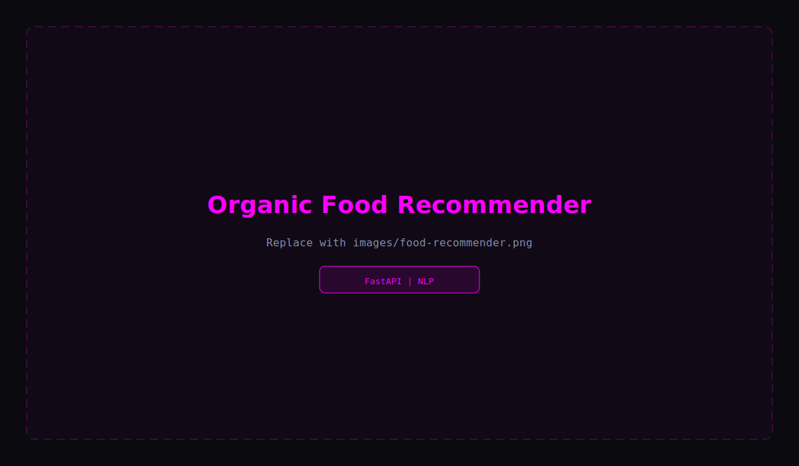 | 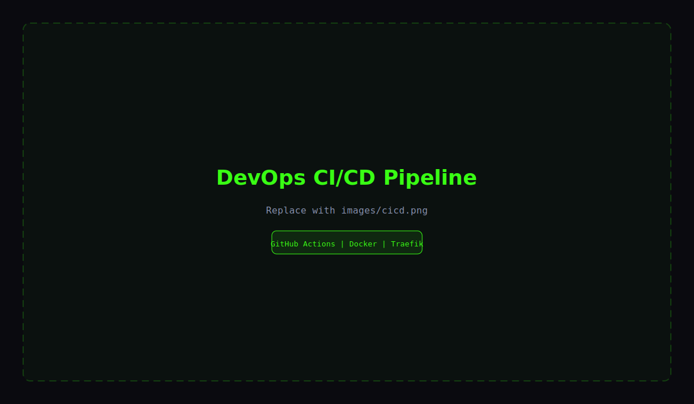 |

<sub>📁 Add your real screenshots to the <code>images/</code> folder — see <a href="./images/README.md">images/README.md</a> for file names</sub>

</div>

---

## 🏗️ Architecture Diagrams

### 🧱 RolloutX Architecture

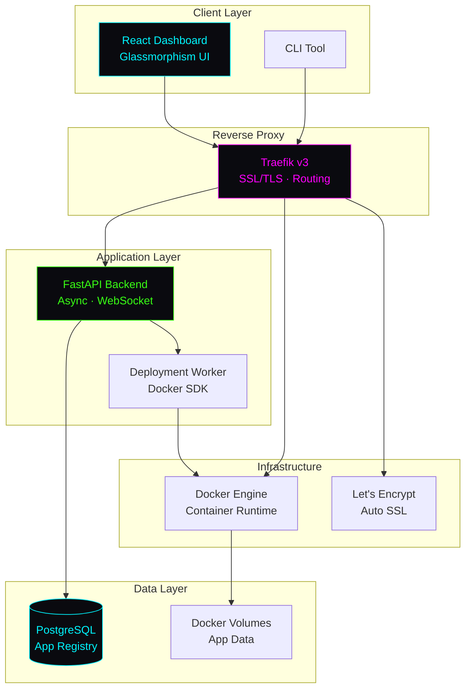

### 📧 Nexudo Mail Architecture

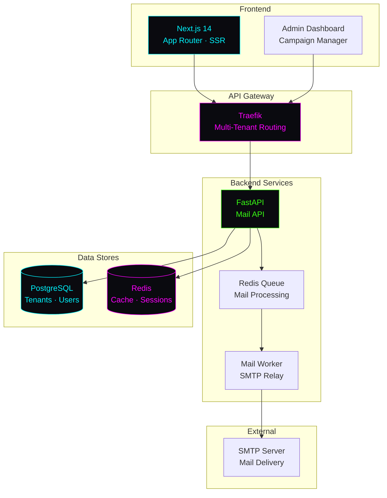

### 🏛️ TNTEU Staff Portal Architecture

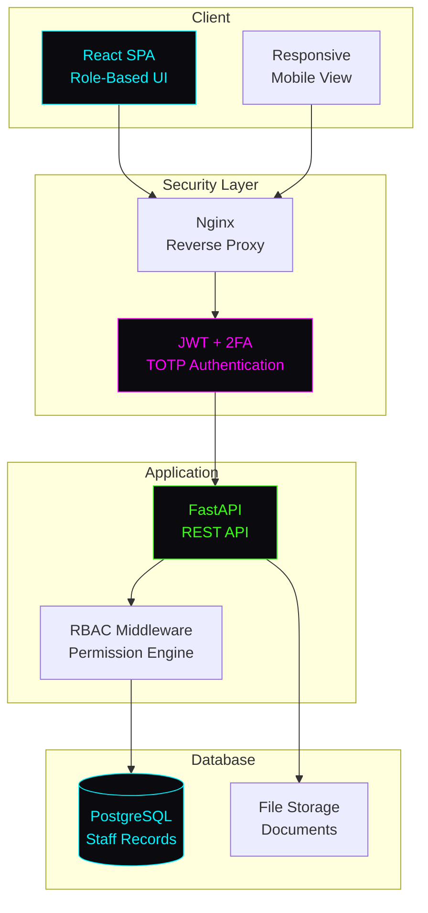

### 🧠 Tech Ecosystem Mindmap

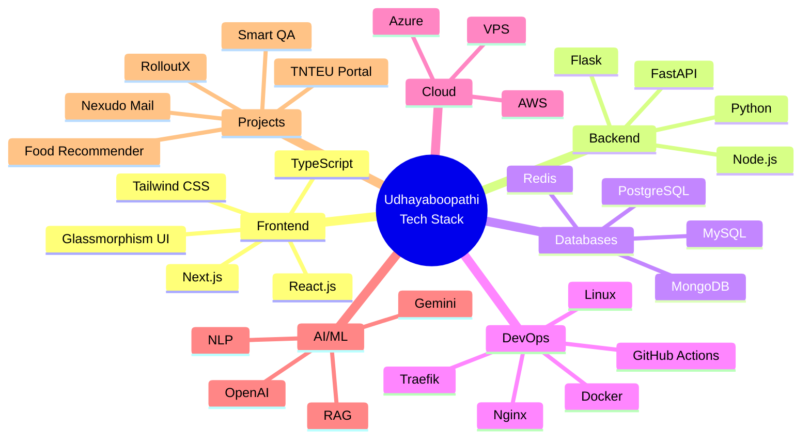

---

## 💼 Experience

<div align="center">

| # | Role | Organization | Duration | Key Responsibilities |
|:-:|:-----|:-------------|:---------|:---------------------|
| 1 | **Developer** | Tamil Nadu Teachers Education University (TNTEU) | 2024 — Present | Staff Portal development, production deployment, RBAC implementation, database optimization |
| 2 | **Data Analyst & Junior Developer** | Nexudo Tech Solutions | 2023 — 2024 | Data analysis pipelines, Nexudo Mail platform, API development, client deliverables |
| 3 | **Linux Server Administrator** | Periyar University | 2022 — 2023 | Server maintenance, security hardening, backup automation, network configuration |
| 4 | **MERN Stack Intern** | Arttifai Tech | 2022 | Full-stack web development, MongoDB integration, REST API design, agile workflows |

</div>

---

## 📅 Timeline

<div align="center">

```
2021 ─────────────────────────────────────────────────────────────── 2026
  │                                                                      │
  ├─ B.Sc Computer Science (Govt. Arts & Science College)             │
  │   2021 ─────────────────────────────── 2024                         │
  │                                                                      │
  ├─ MERN Stack Intern @ Arttifai Tech ──── 2022                        │
  │                                                                      │
  ├─ Linux Server Admin @ Periyar University ──── 2022 ──── 2023        │
  │                                                                      │
  ├─ Data Analyst & Jr. Developer @ Nexudo Tech ──── 2023 ──── 2024     │
  │                                                                      │
  ├─ Developer @ TNTEU ──────────────────────────────── 2024 ──►       │
  │                                                                      │
  ├─ M.Sc Computer Science (Periyar University)                        │
  │   2024 ──────────────────────────────────────────── 2026            │
  │                                                                      │
  ├─ RolloutX PaaS Development ──────────────────────── 2024 ──►       │
  │                                                                      │
  ├─ Nexudo Mail Platform ───────────────────────────── 2024 ──►       │
  │                                                                      │
  └─ Smart QA & AI Projects ───────────────────────────── 2024 ──►       │
```

</div>

<br/>

<details>
<summary><b>📅 Detailed Career Timeline (Click to expand)</b></summary>

<br/>

| Year | Month | Milestone |
|:-----|:------|:----------|
| 2021 | Aug | Started B.Sc Computer Science at Government Arts and Science College |
| 2022 | Jan | MERN Stack Internship at Arttifai Tech — first production experience |
| 2022 | Jun | Linux Server Administrator at Periyar University |
| 2023 | Jan | Data Analyst & Junior Developer at Nexudo Tech Solutions |
| 2023 | Jun | Built Organic Food Recommendation System with NLP |
| 2024 | Jan | Developer role at TNTEU — Staff Portal project begins |
| 2024 | Mar | Started M.Sc Computer Science at Periyar University |
| 2024 | Jun | Architected and launched RolloutX self-hosted PaaS |
| 2024 | Sep | Nexudo Mail enterprise platform development |
| 2024 | Nov | Smart Summarization & Q&A with OpenAI + Gemini |
| 2025 | Jan | TNTEU Staff Portal goes live in production |
| 2025 | Mar | GitHub profile automation with Actions workflows |
| 2025 | Present | Continuing M.Sc, scaling RolloutX and Nexudo Mail |

</details>

---

## 🎓 Education

<div align="center">

| Degree | Institution | Duration | Status | Focus Areas |
|:-------|:------------|:---------|:------:|:------------|
| **M.Sc. Computer Science** | Periyar University, Salem | 2024 — 2026 | 🟢 Ongoing | Advanced Algorithms, Cloud Computing, AI/ML, Research |
| **B.Sc. Computer Science** | Government Arts and Science College | 2021 — 2024 | ✅ Completed | Programming, Databases, Web Development, OS |

</div>

---

## 📜 Certifications

<div align="center">

| Certification | Issuer | Year | Credential |
|:--------------|:-------|:----:|:-----------|
| **Python Programming** | GUVI (Geek Network) | 2023 | Python fundamentals, OOP, data structures, web frameworks |
| **Microsoft Office 365** | Microsoft | 2022 | Word, Excel, PowerPoint, Teams, SharePoint administration |

<br/>


</div>

---

## 🏆 Achievements

<div align="center">

| Achievement | Description |
|:------------|:------------|
| 🏛️ **Production Deployment** | Deployed TNTEU Staff Portal serving university staff statewide |
| 🧱 **PaaS Architecture** | Built RolloutX reducing deployment effort by 70% |
| 📧 **Enterprise Platform** | Architected multi-tenant Nexudo Mail with RBAC & campaigns |
| 🧠 **AI Integration** | Smart QA platform handling 500+ queries/session under 500ms |
| 🐧 **Server Administration** | Managed Linux servers for Periyar University |
| 🎓 **Academic Excellence** | Pursuing M.Sc. while leading production development |
| ⭐ **Open Source** | Active GitHub contributor with multiple production projects |
| 🔄 **CI/CD Automation** | Automated profile metrics and snake animation via GitHub Actions |

</div>

---

## 📊 GitHub Statistics

<div align="center">

### 📈 Stats Overview


&nbsp;


<br/><br/>

### 🔥 GitHub Streak


<br/><br/>

### 📊 Activity Graph


<br/><br/>

### 📅 Contribution Graph


<br/><br/>

### 🏆 GitHub Trophies


<br/><br/>

### 📈 GitHub Metrics (Auto-generated)


<br/><br/>

### 📋 Profile Summary Cards


<br/>


<br/><br/>

### 🐍 Contribution Snake Animation


</div>

---

## 🎵 Spotify Now Playing

<p align="center">
  <a href="https://spotify-github-profile.kittinanx.com/api/view?uid=31irefn5qkpggtnpqxrkcvlo4sq4&redirect=true">
    
  </a>
</p>

---

## 💻 Coding Profile Badges

<div align="center">

[](https://leetcode.com/udhayaboopathi)
[](https://hackerrank.com/udhayaboopathi)
[](https://codechef.com/users/udhayaboopathi)
[](https://auth.geeksforgeeks.org/user/udhayaboopathi)
[](https://practice.geeksforgeeks.org/user/udhayaboopathi)

</div>

---

## 🔗 Social Links

<div align="center">

[](https://udhayaboopathi.tech)
[](https://github.com/Udhayaboopathi)
[](https://linkedin.com/in/udhayaboopathi)
[](mailto:udhayaboopathi2003@gmail.com)

<br/><br/>

[](https://discord.com/users/581142001739628565)
[](https://www.instagram.com/udhayaboopathi_/)
[](https://spotify-github-profile.kittinanx.com/api/view?uid=31irefn5qkpggtnpqxrkcvlo4sq4&redirect=true)

</div>

---

## 💬 Random Dev Quote

<div align="center">


<br/><br/>

> *"First, solve the problem. Then, write the code."* — John Johnson

<br/>

> *"Any fool can write code that a computer can understand. Good programmers write code that humans can understand."* — Martin Fowler

<br/>

> *"The best error message is the one that never shows up."* — Thomas Fuchs

</div>

---

## ☕ Support

<div align="center">

If you find my work helpful or inspiring, consider:

<br/>

⭐ **Starring my repositories** — it motivates more than you think!

🔄 **Forking & contributing** — PRs are always welcome!

📢 **Sharing** — spread the word about open-source projects!

☕ **Buying me a coffee** — fuel for late-night coding sessions!

<br/>

[](https://buymeacoffee.com/udhayaboopathi)
[](https://github.com/sponsors/Udhayaboopathi)

</div>

---

## 🔄 DevOps CI/CD Pipeline

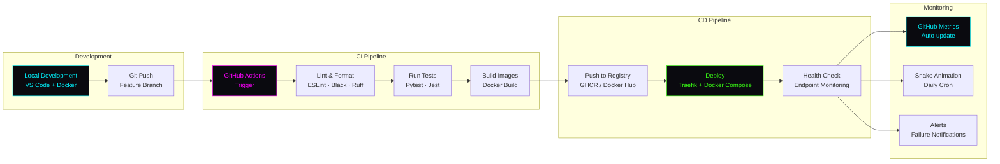

---

## ⚙️ GitHub Actions Workflows

<div align="center">

| Workflow | File | Schedule | Description |
|:---------|:-----|:---------|:------------|
| 🐍 **Snake Animation** | `.github/workflows/snake.yml` | Daily at 00:00 UTC | Generates contribution snake SVG (`#00f5ff` snake) → saves to `assets/snake.svg` |
| 📊 **GitHub Metrics** | `.github/workflows/metrics.yml` | Daily at 06:00 UTC | Generates metrics SVG — commits to `assets/github-metrics.svg` |

</div>

<br/>

<details>
<summary><b>🐍 snake.yml — Snake Animation Workflow Details</b></summary>

<br/>

```yaml
# Key Configuration:
uses: Platane/snk@v3.5.0
outputs: dist/snake.svg (cyberpunk theme)
save_to: assets/snake.svg
schedule: "0 0 * * *" (daily midnight UTC)
```

**Features:**
- Custom cyberpunk color scheme matching profile theme
- Commits directly to `main` branch
- Manual trigger available via `workflow_dispatch`

</details>

<details>
<summary><b>📊 metrics.yml — GitHub Metrics Workflow Details</b></summary>

<br/>

```yaml
# Key Plugins Enabled:
- achievements (threshold: B, secrets: yes)
- activity (14 days, all events)
- calendar, isocalendar (full year)
- languages (8 languages, 14 recent days)
- habits (charts, facts, 14 days)
- lines (base + history)
- notable (commits, PRs, issues)
- people (followers, following)
- reactions, stargazers, stars
- traffic (pages, referrers)
```

**Features:**
- Timezone: Asia/Kolkata
- Animated typing display
- Commits to `assets/github-metrics.svg` on `main`
- Comprehensive developer activity dashboard

</details>

---

## ❓ FAQ

<details>
<summary><b>What technologies do you work with?</b></summary>

<br/>

I specialize in the **MERN + Python** ecosystem with a strong DevOps focus:

- **Frontend:** React, Next.js, TypeScript, Tailwind CSS
- **Backend:** FastAPI, Python, Node.js
- **Databases:** PostgreSQL, MongoDB, Redis
- **DevOps:** Docker, Traefik, GitHub Actions, Linux
- **AI:** OpenAI, Google Gemini, NLP pipelines

</details>

<details>
<summary><b>Are you available for freelance or full-time work?</b></summary>

<br/>

Yes! I'm open to **freelance projects**, **contract roles**, and **full-time opportunities** in Full Stack Development and DevOps Engineering. Reach out via [email](mailto:udhayaboopathi2003@gmail.com) or [LinkedIn](https://linkedin.com/in/udhayaboopathi).

</details>

<details>
<summary><b>What is RolloutX?</b></summary>

<br/>

**RolloutX** is a self-hosted Platform-as-a-Service (PaaS) I built to automate multi-application deployment. It uses Docker for containerization and Traefik for reverse proxy routing with automatic SSL. It reduced manual deployment effort by 70% across my infrastructure.

</details>

<details>
<summary><b>How can I contribute to your projects?</b></summary>

<br/>

1. **Fork** the repository you want to contribute to
2. **Create** a feature branch (`git checkout -b feature/amazing-feature`)
3. **Commit** your changes (`git commit -m 'Add amazing feature'`)
4. **Push** to the branch (`git push origin feature/amazing-feature`)
5. **Open** a Pull Request

All contributions are welcome — bug fixes, features, documentation, and tests!

</details>

<details>
<summary><b>What is your development philosophy?</b></summary>

<br/>

> *"Code should feel alive, intelligent, and effortless."*

I believe in:
- **Build for production** from day one
- **Automate everything** repeatable
- **Security by design**, not as an afterthought
- **Clean, readable code** over clever tricks
- **Containerize** for consistency across environments
- **Document** as you build, not after

</details>

<details>
<summary><b>How is this profile automated?</b></summary>

<br/>

This GitHub profile README is powered by two GitHub Actions workflows:

1. **snake.yml** — Generates contribution snake animation daily → saves to `assets/snake.svg`
2. **metrics.yml** — Generates GitHub metrics daily → saves to `assets/github-metrics.svg`

Both workflows commit directly to `main`. Enable **Settings → Actions → General → Read and write permissions** for workflows to work.

</details>

---

<div align="center">

<br/>

<!-- ═══════════════════ ANIMATED FOOTER ═══════════════════ -->


<br/>


<br/><br/>

**Thanks for visiting!** 

⭐ Star my repos · 🔄 Fork & contribute · 📧 [Get in touch](mailto:udhayaboopathi2003@gmail.com)

<br/>

<sub>Built with 💚 by <a href="https://github.com/Udhayaboopathi">Udhayaboopathi</a> · Salem, Tamil Nadu, India · <a href="https://udhayaboopathi.tech">udhayaboopathi.tech</a></sub>

<br/>


</div>

<!-- ═══════════════════════════════════════════════════════════════════════════
     END OF PROFILE README · Udhayaboopathi · Full Stack & DevOps Engineer
     Last Updated: 2025 · Salem, Tamil Nadu, India
     ═══════════════════════════════════════════════════════════════════════════ -->
